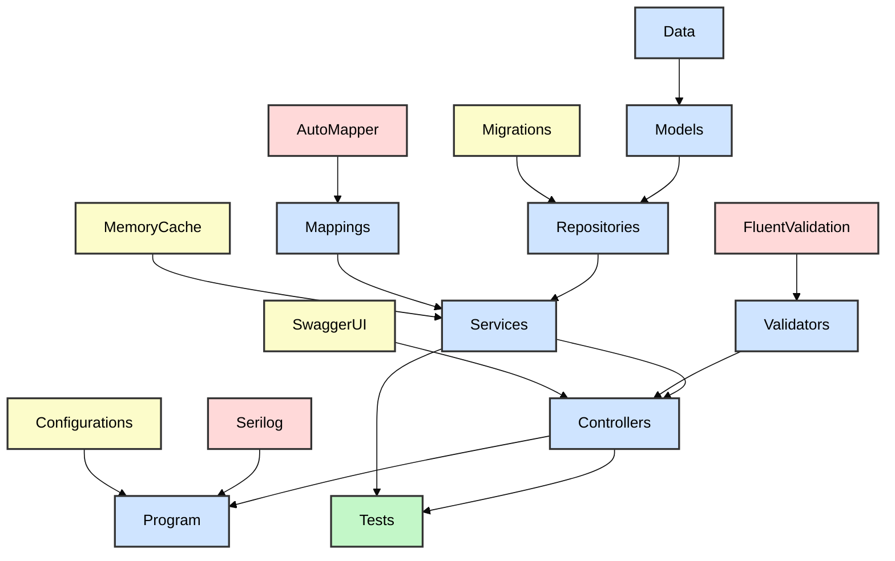

# 🧪 RESTful API with .NET and ASP.NET Core

[](https://github.com/nanotaboada/Dotnet.Samples.AspNetCore.WebApi/actions/workflows/dotnet.yml)
[](https://sonarcloud.io/summary/new_code?id=nanotaboada_Dotnet.Samples.AspNetCore.WebApi)
[](https://dev.azure.com/nanotaboada/Dotnet.Samples.AspNetCore.WebApi/_build/latest?definitionId=14&branchName=master)
[](https://app.codacy.com/gh/nanotaboada/Dotnet.Samples.AspNetCore.WebApi/dashboard?utm_source=gh&utm_medium=referral&utm_content=&utm_campaign=Badge_grade)
[](https://codecov.io/gh/nanotaboada/Dotnet.Samples.AspNetCore.WebApi)
[](https://www.codefactor.io/repository/github/nanotaboada/Dotnet.Samples.AspNetCore.WebApi)
[](https://opensource.org/licenses/MIT)

Proof of Concept for a RESTful API built with .NET 8 (LTS) and ASP.NET Core. Manage football player data with SQLite, Entity Framework Core, Swagger documentation, and in-memory caching.

## Table of Contents

- [Features](#features)
- [Tech Stack](#tech-stack)
- [Project Structure](#project-structure)
- [Architecture](#architecture)
- [API Reference](#api-reference)
- [Prerequisites](#prerequisites)
- [Quick Start](#quick-start)
- [Testing](#testing)
- [Docker](#docker)
- [Environment Variables](#environment-variables)
- [Command Summary](#command-summary)
- [Contributing](#contributing)
- [Legal](#legal)

## Features

- 🔌 RESTful CRUD operations for football player data
- 📚 Interactive API documentation
- 🚦 Fixed window rate limiting
- ⌨️ Input validation
- ⚡ In-memory caching (1-hour TTL)
- 💿 Relational database with ORM
- 🏗️ Layered architecture pattern
- ⌛ Asynchronous operations throughout
- 📝 Structured logging to console and file
- 🩺 Health check endpoint for monitoring
- 🐳 Full containerization support
- ✅ Comprehensive unit tests

## Tech Stack

| Category | Technology |
|----------|------------|
| **Framework** | [.NET 8](https://github.com/dotnet/core) (LTS) |
| **Web Framework** | [ASP.NET Core 8.0](https://github.com/dotnet/aspnetcore) |
| **API Documentation** | [Swashbuckle](https://github.com/domaindrivendev/Swashbuckle.AspNetCore) (OpenAPI 3.0) |
| **Validation** | [FluentValidation 12](https://github.com/FluentValidation/FluentValidation) |
| **Mapping** | [AutoMapper 14](https://github.com/AutoMapper/AutoMapper) |
| **Database** | [SQLite 3](https://github.com/sqlite/sqlite) |
| **ORM** | [Entity Framework Core 9.0](https://github.com/dotnet/efcore) |
| **Logging** | [Serilog 9](https://github.com/serilog/serilog) |
| **Testing** | [xUnit](https://github.com/xunit/xunit), [Moq](https://github.com/devlooped/moq), [FluentAssertions](https://github.com/fluentassertions/fluentassertions) |
| **Containerization** | [Docker](https://github.com/docker) & [Docker Compose](https://github.com/docker/compose) |

## Project Structure

```
src/Dotnet.Samples.AspNetCore.WebApi/
├── Program.cs                  # Entry point: DI setup, middleware pipeline
├── Controllers/                # HTTP handlers (request/response logic)
│   └── PlayerController.cs
├── Services/                   # Business logic + caching layer
│   ├── IPlayerService.cs
│   └── PlayerService.cs
├── Repositories/               # Data access abstraction
│   ├── IPlayerRepository.cs
│   ├── IRepository.cs
│   ├── PlayerRepository.cs
│   └── Repository.cs
├── Models/                     # Domain entities and DTOs
│   ├── Player.cs
│   ├── PlayerRequestModel.cs
│   └── PlayerResponseModel.cs
├── Data/                       # EF Core DbContext
│   └── PlayerDbContext.cs
├── Mappings/                   # AutoMapper profiles
│   └── PlayerMappingProfile.cs
├── Validators/                 # FluentValidation rules
│   └── PlayerRequestModelValidator.cs
├── Configurations/             # Swagger, rate limiting config
├── Extensions/                 # Service registration extensions
├── Utilities/                  # Helper classes
├── Migrations/                 # EF Core migrations
└── storage/                    # Pre-seeded SQLite database

test/Dotnet.Samples.AspNetCore.WebApi.Tests/
└── Unit/                       # Unit tests with xUnit
    ├── PlayerControllerTests.cs
    └── PlayerServiceTests.cs
```

## Architecture

Dependencies flow from data layer through repositories and services to controllers. External dependencies (AutoMapper, FluentValidation, Serilog) integrate at their respective layers.



*Layered architecture: Core application flow (blue), supporting features (yellow), external dependencies (red), and test coverage (green). Not all dependencies are shown.*

## API Reference

Interactive API documentation is available via Swagger UI at `https://localhost:9000/swagger/index.html` when the server is running.

> 💡 **Note:** Swagger documentation is only available in development mode for security reasons.

**Quick Reference:**

- `GET /players` - List all players
- `GET /players/{id}` - Get player by ID (requires authentication)
- `GET /players/squad/{squadNumber}` - Get player by squad number
- `POST /players` - Create new player
- `PUT /players/{squadNumber}` - Update player
- `DELETE /players/{squadNumber}` - Remove player
- `GET /health` - Health check

For complete endpoint documentation with request/response schemas, explore the [interactive Swagger UI](https://localhost:9000/swagger/index.html).

## Prerequisites

Before you begin, ensure you have the following installed:

- .NET 8 SDK (LTS) or higher
- Docker Desktop (optional, for containerized deployment)
- dotnet-ef CLI tool (for database migrations)

  ```bash
  dotnet tool install --global dotnet-ef
  ```

## Quick Start

### Clone the repository

```bash
git clone https://github.com/nanotaboada/Dotnet.Samples.AspNetCore.WebApi.git
cd Dotnet.Samples.AspNetCore.WebApi
```

### Run the application

```bash
dotnet watch run --project src/Dotnet.Samples.AspNetCore.WebApi/Dotnet.Samples.AspNetCore.WebApi.csproj
```

The server will start on `https://localhost:9000`.

### Access the application

- API: `https://localhost:9000`
- Swagger Documentation: `https://localhost:9000/swagger/index.html`
- Health Check: `https://localhost:9000/health`

## Testing

Run the test suite with xUnit:

```bash
# Run all tests
dotnet test

# Run tests with coverage report
dotnet test --results-directory "coverage" --collect:"XPlat Code Coverage" --settings .runsettings

# View coverage report
dotnet tool install --global dotnet-reportgenerator-globaltool
reportgenerator -reports:coverage/**/coverage.cobertura.xml -targetdir:coverage -reporttypes:Html
```

Tests are located in the `test/` directory and use xUnit for unit testing. Coverage reports are generated for controllers and services only.

## Docker

This project includes full Docker support with multi-stage builds and Docker Compose for easy deployment.

### Build the Docker image

```bash
docker compose build
```

### Start the application

```bash
docker compose up
```

> 💡 **Note:** On first run, the container copies a pre-seeded SQLite database into a persistent volume. On subsequent runs, that volume is reused and the data is preserved.

### Stop the application

```bash
docker compose down
```

### Reset the database

To remove the volume and reinitialize the database from the built-in seed file:

```bash
docker compose down -v
```

The containerized application runs on port 9000 and includes health checks that monitor the `/health` endpoint.

## Environment Variables

The application can be configured using environment variables for different scenarios:

### Local Development (`.vscode/launch.json`)

For local debugging and development:

```bash
# ASP.NET Core environment mode
ASPNETCORE_ENVIRONMENT=Development

# Server URLs
ASPNETCORE_URLS=https://localhost:9000

# Show detailed error messages
ASPNETCORE_DETAILEDERRORS=1

# Graceful shutdown timeout
ASPNETCORE_SHUTDOWNTIMEOUTSECONDS=3
```

### Docker Deployment (`compose.yaml`)

For containerized production deployment:

```bash
# Database storage path
# Points to the persistent Docker volume
STORAGE_PATH=/storage/players-sqlite3.db
```

> 💡 **Note:** Additional environment variables (`ASPNETCORE_ENVIRONMENT=Production` and `ASPNETCORE_URLS=http://+:9000`) are set in the `Dockerfile`.

## Command Summary

| Command | Description |
|---------|-------------|
| `dotnet watch run --project src/...` | Start development server with hot reload |
| `dotnet build` | Build the solution |
| `dotnet test` | Run all tests |
| `dotnet test --collect:"XPlat Code Coverage"` | Run tests with coverage report |
| `dotnet ef migrations add <Name>` | Create a new migration |
| `dotnet ef database update` | Apply migrations |
| `./scripts/run-migrations-and-copy-database.sh` | Regenerate database with seed data |
| `docker compose build` | Build Docker image |
| `docker compose up` | Start Docker container |
| `docker compose down` | Stop Docker container |
| `docker compose down -v` | Stop and remove Docker volume |

## Contributing

Contributions are welcome! Please read [CONTRIBUTING.md](CONTRIBUTING.md) for details on the code of conduct and the process for submitting pull requests.

**Key guidelines:**

- Follow [Conventional Commits](https://www.conventionalcommits.org/) for commit messages
- Ensure all tests pass (`dotnet test`)
- Keep changes small and focused
- Review [.github/copilot-instructions.md](.github/copilot-instructions.md) for architectural patterns

## Legal

This is a proof-of-concept project intended for educational and demonstration purposes. All trademarks, registered trademarks, service marks, product names, company names, or logos mentioned are the property of their respective owners and are used for identification purposes only.
