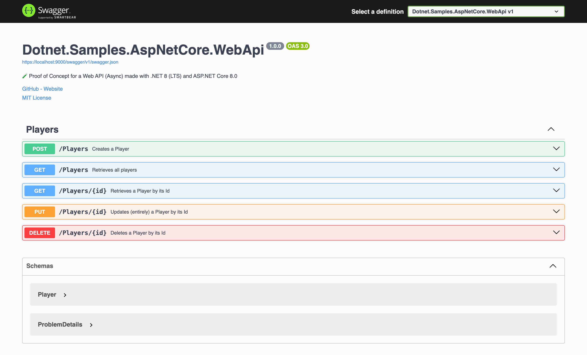

# 🧪 Web API made with .NET 8 (LTS) and ASP.NET Core 8.0

## Status

[](https://github.com/nanotaboada/Dotnet.Samples.AspNetCore.WebApi/actions/workflows/dotnet.yml) [](https://dev.azure.com/nanotaboada/Dotnet.Samples.AspNetCore.WebApi/_build/latest?definitionId=14&branchName=master) [](https://www.codefactor.io/repository/github/nanotaboada/Dotnet.Samples.AspNetCore.WebApi) [](https://codeclimate.com/github/nanotaboada/Dotnet.Samples.AspNetCore.WebApi/maintainability) [](https://app.codacy.com/gh/nanotaboada/Dotnet.Samples.AspNetCore.WebApi/dashboard?utm_source=gh&utm_medium=referral&utm_content=&utm_campaign=Badge_grade) [](https://app.codacy.com/gh/nanotaboada/Dotnet.Samples.AspNetCore.WebApi/dashboard?utm_source=gh&utm_medium=referral&utm_content=&utm_campaign=Badge_coverage)

## Manifesto

> "Nobody should start to undertake a large project. You start with a small _trivial_ project, and you should never expect it to get large. If you do, you'll just overdesign and generally think it is more important than it likely is at that stage. Or worse, you might be scared away by the sheer size of the work you envision. So start small, and think about the details. Don't think about some big picture and fancy design. If it doesn't solve some fairly immediate need, it's almost certainly over-designed. And don't expect people to jump in and help you. That's not how these things work. You need to get something half-way _useful_ first, and then others will say "hey, that _almost_ works for me", and they'll get involved in the project." — Linus Torvalds

## About

Proof of Concept for a Web API made with [ASP.NET Core 8.0](https://learn.microsoft.com/en-us/aspnet/core/release-notes/aspnetcore-8.0?view=aspnetcore-8.0) targeting [.NET 8](https://learn.microsoft.com/en-us/dotnet/core/whats-new/dotnet-8) inspired by the official guide: [Create a web API with ASP.NET Core](https://learn.microsoft.com/en-us/aspnet/core/tutorials/first-web-api?view=aspnetcore-8.0&tabs=visual-studio-code).

## Start

```console
dotnet watch run --project Dotnet.Samples.AspNetCore.WebApi/Dotnet.Samples.AspNetCore.WebApi.csproj
```

## Documentation

```console
https://localhost:9000/swagger/index.html
```



## Credits

The solution has been coded using [Visual Studio Code](https://code.visualstudio.com/) with the [C# Dev Kit](https://marketplace.visualstudio.com/items?itemName=ms-dotnettools.csdevkit) extension.

## Terms

All trademarks, registered trademarks, service marks, product names, company names, or logos mentioned on this repository are the property of their respective owners. All usage of such terms herein is for identification purposes only and constitutes neither an endorsement nor a recommendation of those items. Furthermore, the use of such terms is intended to be for educational and informational purposes only.

## Installation

Kindly run the command below to install the package:

```sh
dotnet add package ApiToolkit.Net
```

## Setup OpenTelemetry

Run the following command to install the OpenTelemetry auto instrumentation for .NET:

```sh
# Download the bash script
curl -sSfL https://github.com/open-telemetry/opentelemetry-dotnet-instrumentation/releases/latest/download/otel-dotnet-auto-install.sh -O

# Install core files
sh ./otel-dotnet-auto-install.sh

# Enable execution for the instrumentation script
chmod +x $HOME/.otel-dotnet-auto/instrument.sh

# Setup the instrumentation for the current shell session
. $HOME/.otel-dotnet-auto/instrument.sh
```

#### OpenTelemetry Configuration

After installating .NET autoinstrumentation packages, you can configure the OpenTelemetry instrumentation by setting the following environment variables:

```sh
export OTEL_EXPORTER_OTLP_ENDPOINT="http://otelcol.apitoolkit.io:4317" # Specifies the endpoint to send the traces to.
export OTEL_DOTNET_AUTO_TRACES_ADDITIONAL_SOURCES="APItoolkit.HTTPInstrumentation" # The apitoolkit instrumentation  activity resource.
export OTEL_SERVICE_NAME="my-service" # Specifies the name of the service.
export OTEL_RESOURCE_ATTRIBUTES="at-project-key={ENTER_YOUR_API_KEY_HERE}" # Adds your API KEY to the resource.
export OTEL_EXPORTER_OTLP_PROTOCOL="grpc" # Specifies the protocol to use for the OpenTelemetry exporter.
```

After setting the environment variables, build and run your application and you should see the logs, traces and metrics in the APIToolkit dashboard.
