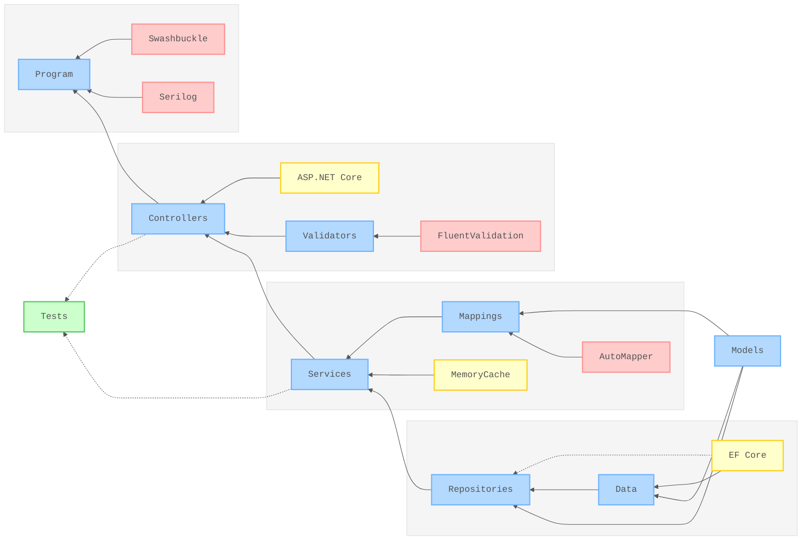

# 🧪 RESTful API with .NET and ASP.NET Core

[](https://github.com/nanotaboada/Dotnet.Samples.AspNetCore.WebApi/actions/workflows/dotnet-ci.yml)
[](https://github.com/nanotaboada/Dotnet.Samples.AspNetCore.WebApi/actions/workflows/dotnet-cd.yml)
[](https://github.com/nanotaboada/Dotnet.Samples.AspNetCore.WebApi/actions/workflows/github-code-scanning/codeql)
[](https://sonarcloud.io/summary/new_code?id=nanotaboada_Dotnet.Samples.AspNetCore.WebApi)
[](https://codecov.io/gh/nanotaboada/Dotnet.Samples.AspNetCore.WebApi)
[](https://www.codefactor.io/repository/github/nanotaboada/Dotnet.Samples.AspNetCore.WebApi)
[](https://opensource.org/licenses/MIT)


Proof of Concept for a RESTful API built with .NET 10 (LTS) and ASP.NET Core. Manage football player data with SQLite, Entity Framework Core, Swagger documentation, and in-memory caching.

## Table of Contents

- [Features](#features)
- [Tech Stack](#tech-stack)
- [Project Structure](#project-structure)
- [Architecture](#architecture)
- [API Reference](#api-reference)
- [Prerequisites](#prerequisites)
- [Quick Start](#quick-start)
- [Testing](#testing)
- [Containers](#containers)
- [Releases](#releases)
- [Environment Variables](#environment-variables)
- [Command Summary](#command-summary)
- [Contributing](#contributing)
- [Legal](#legal)

## Features

- 🏗️ **Clean layered architecture** - Repository pattern, dependency injection, and async operations throughout
- 📚 **Interactive API exploration** - Swagger UI documentation with health monitoring endpoints
- ⚡ **Performance optimizations** - In-memory caching, rate limiting, and efficient database queries
- 🧪 **High test coverage** - xUnit tests with automated reporting to Codecov and SonarCloud
- 📖 **Token-efficient documentation** - Custom instructions with coding guidelines, architecture rules, and agent workflows for AI-assisted development
- 🐳 **Full containerization** - Multi-stage Docker builds with Docker Compose orchestration
- 🔄 **Complete CI/CD pipeline** - Automated testing, code quality checks, Docker publishing, and GitHub releases
- 🏟️ **Stadium-themed semantic versioning** - Memorable, alphabetical release names from World Cup venues

## Tech Stack

| Category | Technology |
| -------- | ---------- |
| **Framework** | [.NET 10](https://github.com/dotnet/core) (LTS) |
| **Web Framework** | [ASP.NET Core 10.0](https://github.com/dotnet/aspnetcore) |
| **API Documentation** | [Swashbuckle](https://github.com/domaindrivendev/Swashbuckle.AspNetCore) (OpenAPI 3.0) |
| **Validation** | [FluentValidation 12](https://github.com/FluentValidation/FluentValidation) |
| **Mapping** | [AutoMapper 14](https://github.com/AutoMapper/AutoMapper) |
| **Database** | [SQLite 3](https://github.com/sqlite/sqlite) |
| **ORM** | [Entity Framework Core 10.0](https://github.com/dotnet/efcore) |
| **Logging** | [Serilog 9](https://github.com/serilog/serilog) |
| **Testing** | [xUnit](https://github.com/xunit/xunit), [Moq](https://github.com/devlooped/moq), [FluentAssertions](https://github.com/fluentassertions/fluentassertions) |
| **Containerization** | [Docker](https://github.com/docker) & [Docker Compose](https://github.com/docker/compose) |

## Project Structure

```text
src/Dotnet.Samples.AspNetCore.WebApi/
├── Program.cs                  # Entry point: DI setup, middleware pipeline
├── Controllers/                # HTTP handlers (request/response logic)
│   └── PlayerController.cs
├── Services/                   # Business logic + caching layer
│   ├── IPlayerService.cs
│   └── PlayerService.cs
├── Repositories/               # Data access abstraction
│   ├── IPlayerRepository.cs
│   ├── IRepository.cs
│   ├── PlayerRepository.cs
│   └── Repository.cs
├── Models/                     # Domain entities and DTOs
│   ├── Player.cs
│   ├── PlayerRequestModel.cs
│   └── PlayerResponseModel.cs
├── Data/                       # EF Core DbContext and migrations
│   └── PlayerDbContext.cs
├── Mappings/                   # AutoMapper profiles
│   └── PlayerMappingProfile.cs
├── Validators/                 # FluentValidation rules
│   └── PlayerRequestModelValidator.cs
├── Configurations/             # Swagger, rate limiting config
├── Enums/                      # Domain enumerations (e.g. Position)
├── Extensions/                 # Service registration extensions
├── Middlewares/                # Custom ASP.NET Core middleware
├── Utilities/                  # Helper classes
├── Migrations/                 # EF Core migrations
└── storage/                    # Pre-seeded SQLite database

test/Dotnet.Samples.AspNetCore.WebApi.Tests/
├── Unit/                       # Unit tests with xUnit
│   ├── PlayerControllerTests.cs
│   ├── PlayerServiceTests.cs
│   └── PlayerValidatorTests.cs
└── Utilities/                  # Shared test helpers
    ├── DatabaseFakes.cs
    ├── PlayerFakes.cs
    ├── PlayerMocks.cs
    └── PlayerStubs.cs
```

## Architecture

Layered architecture with dependency injection via constructors and interface-based contracts.


```mermaid

%%{init: {
  "theme": "default",
  "themeVariables": {
    "fontFamily": "Fira Code, Consolas, monospace",
    "textColor": "#555",
    "lineColor": "#555",
    "clusterBkg": "#f5f5f5",
    "clusterBorder": "#ddd"
  }
}}%%

graph RL

    Tests[Tests]

    subgraph Layer1[" "]
        Program[Program]
        Serilog[Serilog]
        Swashbuckle[Swashbuckle]
    end

    subgraph Layer2[" "]
        Controllers[Controllers]
        Validators[Validators]
        FluentValidation[FluentValidation]
        AspNetCore[ASP.NET Core]
    end

    subgraph Layer3[" "]
        Services[Services]
        Mappings[Mappings]
        AutoMapper[AutoMapper]
        MemoryCache[MemoryCache]
    end

    subgraph Layer4[" "]
        Repositories[Repositories]
        Data[Data]
        EFCore[EF Core]
    end

    Models[Models]

    %% Strong dependencies

    %% Layer 1
    Controllers --> Program
    Serilog --> Program
    Swashbuckle --> Program

    %% Layer 2
    Services --> Controllers
    Validators --> Controllers
    FluentValidation --> Validators
    AspNetCore --> Controllers

    %% Layer 3
    Repositories --> Services
    MemoryCache --> Services
    Mappings --> Services
    AutoMapper --> Mappings
    Models --> Mappings

    %% Layer 4
    Models --> Repositories
    Models --> Data
    Data --> Repositories
    EFCore --> Data
    EFCore -.-> Repositories

    %% Soft dependencies

    Services -.-> Tests
    Controllers -.-> Tests

    %% Node styling with stroke-width
    classDef core fill:#b3d9ff,stroke:#6db1ff,stroke-width:2px,color:#555,font-family:monospace;
    classDef deps fill:#ffcccc,stroke:#ff8f8f,stroke-width:2px,color:#555,font-family:monospace;
    classDef test fill:#ccffcc,stroke:#53c45e,stroke-width:2px,color:#555,font-family:monospace;
    classDef feat fill:#ffffcc,stroke:#fdce15,stroke-width:2px,color:#555,font-family:monospace;

    class Data,Models,Repositories,Services,Controllers,Program,Validators,Mappings core;
    class AutoMapper,FluentValidation,Serilog,Swashbuckle deps;
    class Tests test;
    class AspNetCore,EFCore,MemoryCache feat;
```

### Arrow Semantics

Arrows point from a dependency toward its consumer. Solid arrows (`-->`) denote **strong (functional) dependencies**: the consumer actively invokes behavior — registering types with the IoC container, executing queries, applying mappings, or handling HTTP requests. Dotted arrows (`-.->`) denote **soft (structural) dependencies**: the consumer only references types or interfaces without invoking runtime behavior. This distinction follows UML's `«use»` dependency notation and classical coupling theory (Myers, 1978): strong arrows approximate *control or stamp coupling*, while soft arrows approximate *data coupling*, where only shared data structures cross the boundary.

### Composition Root Pattern

The `Program` module acts as the composition root — it is the sole site where dependencies are registered with the IoC container, wired via interfaces, and resolved at runtime by the ASP.NET Core host. Rather than explicit object construction, .NET relies on built-in dependency injection: `Program` registers services, repositories, DbContext, mappers, validators, and middleware, and the framework instantiates them on demand. This pattern enables dependency injection, improves testability, and ensures no other module bears responsibility for type registration or lifecycle management.

### Layered Architecture

The codebase is organized into four conceptual layers: Initialization (`Program`), HTTP (`Controllers`, `Validators`), Business (`Services`, `Mappings`), and Data (`Repositories`, `Data`).

Framework packages and third-party dependencies are co-resident within the layer that consumes them: `Serilog` and `Swashbuckle` inside Initialization, `ASP.NET Core` and `FluentValidation` inside HTTP, `AutoMapper` inside Business, and `EF Core` inside Data. `ASP.NET Core`, `EF Core`, and `MemoryCache` are Microsoft platform packages (yellow); `AutoMapper`, `FluentValidation`, `Serilog`, and `Swashbuckle` are third-party packages (red).

The `Models` package is a **cross-cutting type concern** — it defines shared entities and DTOs consumed across multiple layers via strong dependencies, without containing logic or behavior of its own. Dependencies always flow from consumers toward their lower-level types: each layer depends on (consumes) the layers below it, and no layer invokes behavior in a layer above it.

### Color Coding

Core packages (blue) implement the application logic, supporting features (yellow) are Microsoft platform packages, third-party dependencies (red) are community packages, and tests (green) ensure code quality.

*Simplified, conceptual view — not all components or dependencies are shown.*

## API Reference

Interactive API documentation is available via Swagger UI at `https://localhost:9000/swagger/index.html` when the server is running.

> 💡 Swagger documentation is only available in development mode for security reasons.

**Quick Reference:**

- `GET /players` - List all players
- `GET /players/{id:Guid}` - Get player by ID (requires authentication)
- `GET /players/squadNumber/{squadNumber:int}` - Get player by squad number
- `POST /players` - Create new player
- `PUT /players/squadNumber/{squadNumber:int}` - Update player
- `DELETE /players/squadNumber/{squadNumber:int}` - Remove player
- `GET /health` - Health check

For complete endpoint documentation with request/response schemas, explore the [interactive Swagger UI](https://localhost:9000/swagger/index.html).

## Prerequisites

Before you begin, ensure you have the following installed:

- .NET 10 SDK (LTS) or higher
- Docker Desktop (optional, for containerized deployment)
- dotnet-ef CLI tool (for database migrations)

  ```bash
  dotnet tool install --global dotnet-ef
  ```

## Quick Start

### Clone the repository

```bash
git clone https://github.com/nanotaboada/Dotnet.Samples.AspNetCore.WebApi.git
cd Dotnet.Samples.AspNetCore.WebApi
```

### Run the application

```bash
dotnet watch run --project src/Dotnet.Samples.AspNetCore.WebApi/Dotnet.Samples.AspNetCore.WebApi.csproj
```

The server will start on `https://localhost:9000`.

### Access the application

- API: `https://localhost:9000`
- Swagger Documentation: `https://localhost:9000/swagger/index.html`
- Health Check: `https://localhost:9000/health`

## Testing

Run the test suite with xUnit:

```bash
# Run all tests
dotnet test

# Run tests with coverage report
dotnet test --results-directory "coverage" --collect:"XPlat Code Coverage" --settings .runsettings

# View coverage report
dotnet tool install --global dotnet-reportgenerator-globaltool
reportgenerator -reports:coverage/**/coverage.cobertura.xml -targetdir:coverage -reporttypes:Html
```

Tests are located in the `test/` directory and use xUnit for unit testing. Coverage reports are generated for controllers and services only.

## Containers

This project includes full Docker support with multi-stage builds and Docker Compose for easy deployment.

### Build the Docker image

```bash
docker compose build
```

### Start the application

```bash
docker compose up
```

> 💡 On first run, the container copies a pre-seeded SQLite database into a persistent volume. On subsequent runs, that volume is reused and the data is preserved.

### Stop the application

```bash
docker compose down
```

### Reset the database

To remove the volume and reinitialize the database from the built-in seed file:

```bash
docker compose down -v
```

The containerized application runs on port 9000 and includes health checks that monitor the `/health` endpoint.

## Releases

This project uses **stadium-themed release names** inspired by famous football stadiums that hosted FIFA World Cup matches. Each release is named after a stadium (A-Z alphabetically), making versions memorable and fun.

### Release Naming Convention

Releases follow the pattern: `v{SEMVER}-{STADIUM}` (e.g., `v1.0.0-azteca`)

- **Semantic Version**: Standard versioning (MAJOR.MINOR.PATCH)
- **Stadium Name**: Alphabetically ordered codename from the [stadium list](CHANGELOG.md#stadium-release-names)

### Create a Release

To create a new release, follow this workflow:

#### 1. Update CHANGELOG.md

First, create a `release/` branch and document your changes in [CHANGELOG.md](CHANGELOG.md):

```bash
git checkout -b release/1.0.0-azteca
# Move items from [Unreleased] to new release section
# Example: [1.0.0 - azteca] - 2026-01-22
git add CHANGELOG.md
git commit -m "docs: prepare changelog for v1.0.0-azteca release"
git push origin release/1.0.0-azteca
# Open a PR, get it reviewed, and merge into master
```

#### 2. Create and Push Tag

Then create and push the version tag:

```bash
git tag -a v1.0.0-azteca -m "Release 1.0.0 - Azteca"
git push origin v1.0.0-azteca
```

#### 3. Automated CD Workflow

This triggers the CD workflow which automatically:

1. Validates the stadium name
2. Builds and tests the project in Release configuration
3. Publishes Docker images to GitHub Container Registry with three tags
4. Creates a GitHub Release with auto-generated changelog from commits

> 💡 Always update CHANGELOG.md before creating the tag. See [CHANGELOG.md](CHANGELOG.md#how-to-release) for detailed release instructions.

### Pull Docker Images

Each release publishes multiple tags for flexibility:

```bash
# By semantic version (recommended for production)
docker pull ghcr.io/nanotaboada/dotnet-samples-aspnetcore-webapi:1.0.0

# By stadium name (memorable alternative)
docker pull ghcr.io/nanotaboada/dotnet-samples-aspnetcore-webapi:azteca

# Latest release
docker pull ghcr.io/nanotaboada/dotnet-samples-aspnetcore-webapi:latest
```

> 💡 See [CHANGELOG.md](CHANGELOG.md) for the complete stadium list (A-Z) and release history.

## Environment Variables

The application can be configured using environment variables for different scenarios:

### Local Development (`.vscode/launch.json`)

For local development and debugging:

```bash
# ASP.NET Core environment mode
ASPNETCORE_ENVIRONMENT=Development

# Server URLs
ASPNETCORE_URLS=https://localhost:9000

# Show detailed error messages
ASPNETCORE_DETAILEDERRORS=1

# Graceful shutdown timeout
ASPNETCORE_SHUTDOWNTIMEOUTSECONDS=3
```

### Container Deployment (`compose.yaml`)

For production deployment:

```bash
# Database storage path
# Points to the persistent Docker volume
STORAGE_PATH=/storage/players-sqlite3.db
```

> 💡 Additional environment variables (`ASPNETCORE_ENVIRONMENT=Production` and `ASPNETCORE_URLS=http://+:9000`) are set in the `Dockerfile`.

## Command Summary

| Command | Description |
| ------- | ----------- |
| `dotnet watch run --project src/...` | Start development server with hot reload |
| `dotnet build` | Build the solution |
| `dotnet test` | Run all tests |
| `dotnet test --collect:"XPlat Code Coverage"` | Run tests with coverage report |
| `dotnet csharpier .` | Format source code |
| `dotnet ef migrations add <Name>` | Create a new migration |
| `dotnet ef database update` | Apply migrations |
| `./scripts/run-migrations-and-copy-database.sh` | Regenerate database with seed data |
| `docker compose build` | Build Docker image |
| `docker compose up` | Start Docker container |
| `docker compose down` | Stop Docker container |
| `docker compose down -v` | Stop and remove Docker volume |

## Contributing

Contributions are welcome! Please read [CONTRIBUTING.md](CONTRIBUTING.md) for details on the code of conduct and the process for submitting pull requests.

**Key guidelines:**

- Follow [Conventional Commits](https://www.conventionalcommits.org/) for commit messages
- Ensure all tests pass (`dotnet test`)
- Keep changes small and focused
- Review [.github/copilot-instructions.md](.github/copilot-instructions.md) for architectural patterns

## Legal

This project is provided for educational and demonstration purposes and may be used in production environments at your discretion. All referenced trademarks, service marks, product names, company names, and logos are the property of their respective owners and are used solely for identification or illustrative purposes.
