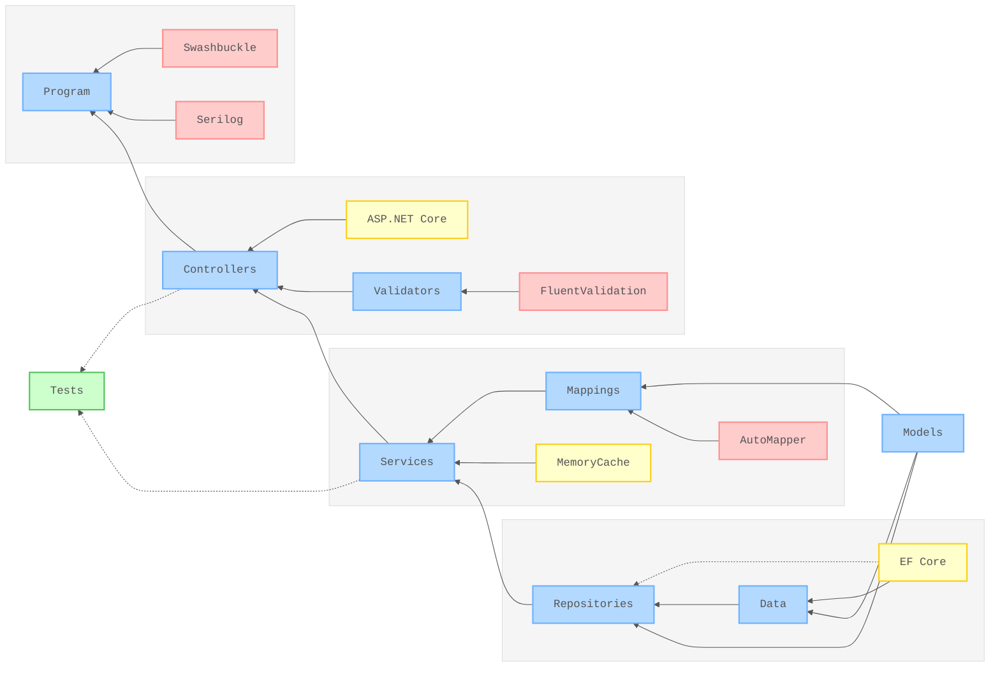

# 🧪 RESTful API with .NET and ASP.NET Core

[](https://github.com/nanotaboada/Dotnet.Samples.AspNetCore.WebApi/actions/workflows/dotnet-ci.yml)
[](https://github.com/nanotaboada/Dotnet.Samples.AspNetCore.WebApi/actions/workflows/dotnet-cd.yml)
[](https://github.com/nanotaboada/Dotnet.Samples.AspNetCore.WebApi/actions/workflows/github-code-scanning/codeql)
[](https://sonarcloud.io/summary/new_code?id=nanotaboada_Dotnet.Samples.AspNetCore.WebApi)
[](https://codecov.io/gh/nanotaboada/Dotnet.Samples.AspNetCore.WebApi)
[](https://www.codefactor.io/repository/github/nanotaboada/Dotnet.Samples.AspNetCore.WebApi)
[](https://opensource.org/licenses/MIT)


Proof of Concept for a RESTful API built with .NET 10 (LTS) and ASP.NET Core. Manage football player data with SQLite, Entity Framework Core, Swagger documentation, and in-memory caching.

## Features

- 🏗️ **Clean layered architecture** - Repository pattern, dependency injection, and async operations throughout
- 📚 **Interactive API exploration** - Swagger UI documentation with health monitoring endpoints
- ⚡ **Performance optimizations** - In-memory caching, rate limiting, and efficient database queries
- ✅ **Input Validation** - FluentValidation rule sets with CRUD-scoped constraints and RFC 7807 error responses
- 🐳 **Full containerization** - Multi-stage Docker builds with Docker Compose orchestration
- 🔄 **Complete CI/CD pipeline** - Automated testing, code quality checks, Docker publishing, and GitHub releases

## Tech Stack

| Category | Technology |
| -------- | ---------- |
| **Framework** | [.NET 10](https://github.com/dotnet/core) (LTS) |
| **Web Framework** | [ASP.NET Core 10.0](https://github.com/dotnet/aspnetcore) |
| **API Documentation** | [Swashbuckle](https://github.com/domaindrivendev/Swashbuckle.AspNetCore) (OpenAPI 3.0) |
| **Validation** | [FluentValidation 12](https://github.com/FluentValidation/FluentValidation) |
| **Mapping** | [AutoMapper 14](https://github.com/AutoMapper/AutoMapper) |
| **Database** | [SQLite 3](https://github.com/sqlite/sqlite) |
| **ORM** | [Entity Framework Core 10.0](https://github.com/dotnet/efcore) |
| **Logging** | [Serilog 9](https://github.com/serilog/serilog) |
| **Testing** | [xUnit](https://github.com/xunit/xunit), [Moq](https://github.com/devlooped/moq), [FluentAssertions](https://github.com/fluentassertions/fluentassertions) |
| **Containerization** | [Docker](https://github.com/docker) & [Docker Compose](https://github.com/docker/compose) |

## Architecture

Layered architecture with dependency injection via constructors and interface-based contracts.


```mermaid

%%{init: {
  "theme": "default",
  "themeVariables": {
    "fontFamily": "Fira Code, Consolas, monospace",
    "textColor": "#555",
    "lineColor": "#555",
    "clusterBkg": "#f5f5f5",
    "clusterBorder": "#ddd"
  }
}}%%

graph RL

    Tests[Tests]

    subgraph Layer1[" "]
        Program[Program]
        Serilog[Serilog]
        Swashbuckle[Swashbuckle]
    end

    subgraph Layer2[" "]
        Controllers[Controllers]
        Validators[Validators]
        FluentValidation[FluentValidation]
        AspNetCore[ASP.NET Core]
    end

    subgraph Layer3[" "]
        Services[Services]
        Mappings[Mappings]
        AutoMapper[AutoMapper]
        MemoryCache[MemoryCache]
    end

    subgraph Layer4[" "]
        Repositories[Repositories]
        Data[Data]
        EFCore[EF Core]
    end

    Models[Models]

    %% Strong dependencies

    %% Layer 1
    Controllers --> Program
    Serilog --> Program
    Swashbuckle --> Program

    %% Layer 2
    Services --> Controllers
    Validators --> Controllers
    FluentValidation --> Validators
    AspNetCore --> Controllers

    %% Layer 3
    Repositories --> Services
    MemoryCache --> Services
    Mappings --> Services
    AutoMapper --> Mappings
    Models --> Mappings

    %% Layer 4
    Models --> Repositories
    Models --> Data
    Data --> Repositories
    EFCore --> Data
    EFCore -.-> Repositories

    %% Soft dependencies

    Services -.-> Tests
    Controllers -.-> Tests

    %% Node styling with stroke-width
    classDef core fill:#b3d9ff,stroke:#6db1ff,stroke-width:2px,color:#555,font-family:monospace;
    classDef deps fill:#ffcccc,stroke:#ff8f8f,stroke-width:2px,color:#555,font-family:monospace;
    classDef test fill:#ccffcc,stroke:#53c45e,stroke-width:2px,color:#555,font-family:monospace;
    classDef feat fill:#ffffcc,stroke:#fdce15,stroke-width:2px,color:#555,font-family:monospace;

    class Data,Models,Repositories,Services,Controllers,Program,Validators,Mappings core;
    class AutoMapper,FluentValidation,Serilog,Swashbuckle deps;
    class Tests test;
    class AspNetCore,EFCore,MemoryCache feat;
```

> *Arrows follow the injection direction (A → B means A is injected into B). Solid = runtime dependency, dotted = structural. Blue = core domain, red = third-party, green = tests. Controllers call Services; Services call Repositories — bypassing layers is not permitted.*
>
> *Significant design decisions are documented as ADRs in [`adr/`](adr/README.md).*

## API Reference

Interactive API documentation is available via Swagger UI at `https://localhost:9000/swagger/index.html` when the server is running.

> 💡 Swagger documentation is only available in development mode for security reasons.

| Method | Endpoint | Description | Status |
| ------ | -------- | ----------- | ------ |
| `GET` | `/players` | List all players | `200 OK` |
| `GET` | `/players/{id:Guid}` | Get player by ID *(requires authentication)* | `200 OK` |
| `GET` | `/players/squadNumber/{squadNumber:int}` | Get player by squad number | `200 OK` |
| `POST` | `/players` | Create new player | `201 Created` |
| `PUT` | `/players/squadNumber/{squadNumber:int}` | Update player by squad number | `204 No Content` |
| `DELETE` | `/players/squadNumber/{squadNumber:int}` | Remove player by squad number | `204 No Content` |
| `GET` | `/health` | Health check | `200 OK` |

Error codes: `400 Bad Request` (validation failed) · `404 Not Found` (player not found) · `409 Conflict` (duplicate squad number on `POST`)

For complete endpoint documentation with request/response schemas, explore the [interactive Swagger UI](https://localhost:9000/swagger/index.html).

## Prerequisites

Before you begin, ensure you have the following installed:

- .NET 10 SDK (LTS) or higher
- Docker Desktop (optional, for containerized deployment)
- dotnet-ef CLI tool (optional, for creating new migrations)

  ```bash
  dotnet tool install --global dotnet-ef
  ```

## Quick Start

### Clone the repository

```bash
git clone https://github.com/nanotaboada/Dotnet.Samples.AspNetCore.WebApi.git
cd Dotnet.Samples.AspNetCore.WebApi
```

### Run the application

```bash
dotnet watch run --project src/Dotnet.Samples.AspNetCore.WebApi/Dotnet.Samples.AspNetCore.WebApi.csproj
```

The server will start on `https://localhost:9000`.

### Access the application

- API: `https://localhost:9000`
- Swagger Documentation: `https://localhost:9000/swagger/index.html`
- Health Check: `https://localhost:9000/health`

## Containers

This project includes full Docker support with multi-stage builds and Docker Compose for easy deployment.

### Build the Docker image

```bash
docker compose build
```

### Start the application

```bash
docker compose up
```

> 💡 On first run, the app applies EF Core migrations and seeds the database automatically into a persistent volume. On subsequent runs, that volume is reused and the data is preserved.

### Stop the application

```bash
docker compose down
```

### Reset the database

To remove the volume and let the app re-create and re-seed the database on next startup:

```bash
docker compose down -v
```

The containerized application runs on port 9000 and includes health checks that monitor the `/health` endpoint.

### Pull Docker images

Each release publishes multiple tags for flexibility:

```bash
# By semantic version (recommended for production)
docker pull ghcr.io/nanotaboada/dotnet-samples-aspnetcore-webapi:1.0.0

# By stadium name (memorable alternative)
docker pull ghcr.io/nanotaboada/dotnet-samples-aspnetcore-webapi:azteca

# Latest release
docker pull ghcr.io/nanotaboada/dotnet-samples-aspnetcore-webapi:latest
```

## Environment Variables

The application can be configured using environment variables for different scenarios:

### Local Development (`.vscode/launch.json`)

For local development and debugging:

```bash
# ASP.NET Core environment mode
ASPNETCORE_ENVIRONMENT=Development

# Server URLs
ASPNETCORE_URLS=https://localhost:9000

# Show detailed error messages
ASPNETCORE_DETAILEDERRORS=1

# Graceful shutdown timeout
ASPNETCORE_SHUTDOWNTIMEOUTSECONDS=3
```

### Container Deployment (`compose.yaml`)

For production deployment:

```bash
# Database storage path
# Points to the persistent Docker volume
STORAGE_PATH=/storage/players-sqlite3.db
```

> 💡 Additional environment variables (`ASPNETCORE_ENVIRONMENT=Production` and `ASPNETCORE_URLS=http://+:9000`) are set in the `Dockerfile`.

## Contributing

Contributions are welcome! Please read [CONTRIBUTING.md](CONTRIBUTING.md) for details on the code of conduct and the process for submitting pull requests.

**Key guidelines:**

- Follow [Conventional Commits](https://www.conventionalcommits.org/) for commit messages
- Ensure all tests pass (`dotnet test`)
- Keep changes small and focused
- Review [.github/copilot-instructions.md](.github/copilot-instructions.md) for architectural patterns

**Testing:**

Run the test suite with xUnit:

```bash
# Run all tests
dotnet test

# Run tests with coverage report
dotnet test --results-directory "coverage" --collect:"XPlat Code Coverage" --settings .runsettings
```

## Command Summary

| Command | Description |
| ------- | ----------- |
| `dotnet watch run --project src/...` | Start development server with hot reload |
| `dotnet build` | Build the solution |
| `dotnet test` | Run all tests |
| `dotnet test --collect:"XPlat Code Coverage"` | Run tests with coverage report |
| `dotnet csharpier .` | Format source code |
| `dotnet ef migrations add <Name>` | Create a new migration |
| `dotnet ef database update` | Apply migrations manually |
| `docker compose build` | Build Docker image |
| `docker compose up` | Start Docker container |
| `docker compose down` | Stop Docker container |
| `docker compose down -v` | Stop and remove Docker volume |
| **AI Commands** | |
| `/pre-commit` | Runs linting, tests, and quality checks before committing |
| `/pre-release` | Runs pre-release validation workflow |

## Legal

This project is provided for educational and demonstration purposes and may be used in production at your own discretion. All trademarks, service marks, product names, company names, and logos referenced herein are the property of their respective owners and are used solely for identification or illustrative purposes.
